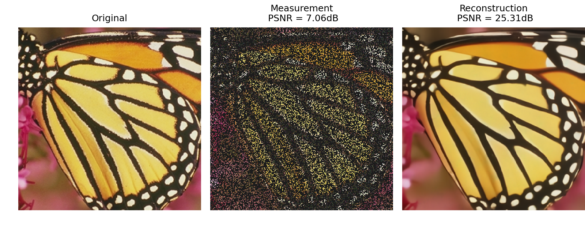
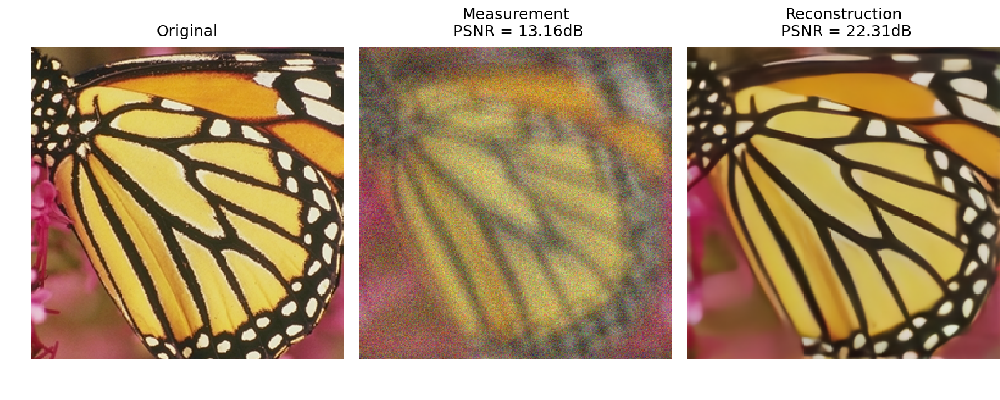
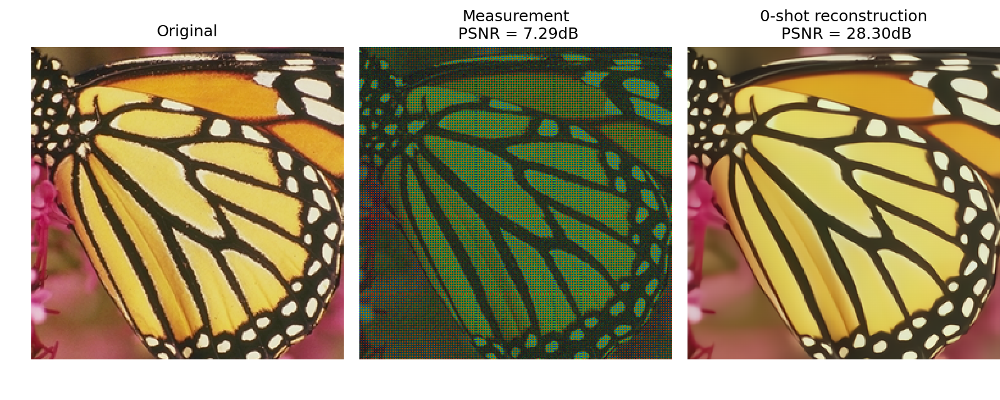

# Reconstruct Anything Model (RAM)

> A non-iterative, lightweight foundational model for computational imaging.

[Matthieu Terris](https://matthieuterris.github.io), [Samuel Hurault](https://samuelhurault.netlify.app/), [Maxime Song](https://www.linkedin.com/in/maxime-song-ai-engineer/?originalSubdomain=fr), [Julián Tachella](https://tachella.github.io/)

[](https://arxiv.org/abs/2503.08915)
[](https://github.com/matthieutrs/ram)
[](https://matthieutrs.github.io/ram-page/)
[](https://colab.research.google.com/drive/1PqcrPyDv3VUbtM-YsISQDX0bFL6egPa-?usp=sharing)


---

## Overview

The **Reconstruct Anything Model (RAM)** is a single, non-iterative neural network architecture designed to solve a wide range of imaging inverse problems — including **denoising, deblurring, inpainting, MRI, CT, and super-resolution** — without task-specific tuning or retraining.

RAM builds upon DRUNet and introduces several key innovations:

- **Proximal Estimation Module** for robust initialization using a learned proximal operator.  
- **Krylov Subspace Module (KSM)** to inject physics-based priors via learned combinations of gradient and adjoint terms.  
- **Multiscale Operator Conditioning** that allows solving ill-posed problems efficiently on coarser grids.  
- **Noise Conditioning** using Poisson-Gaussian models for real-world robustness.  
- **Modality-Aware Layers** supporting grayscale, color, and complex-valued inputs with shared weights.

---

## Visual Demo

Explore our interactive web demo here:  
👉 [**RAM Project Page**](https://matthieutrs.github.io/ram-page/)

---

## HuggingFace Real-Time Demo

Explore our hugging face demo here:  
👉 [**RAM Hugging Face Space**](https://huggingface.co/spaces/deepinv/denoising/)

---

## Applications

RAM supports many tasks **out-of-the-box** or with **few-shot self-supervised fine-tuning**, such as:

- Low-light imaging (Poisson noise)  
- Medical imaging (MRI, CT)  
- Microscopy  
- Super-resolution  
- Compressed sensing  
- Deblurring (motion, Gaussian)
- Inpainting
- Demosaicing
- General inverse problems with known physics
---

## Installation

```bash
pip install git+https://github.com/matthieutrs/ram
```

---

## Usage

See the demo scripts in `ram/demo` for more details! You can also [run this script in Google Colab](https://colab.research.google.com/drive/1PqcrPyDv3VUbtM-YsISQDX0bFL6egPa-?usp=sharing).

### Inference with pretrained weights

```python
from ram import RAM
import deepinv as dinv

# run on GPU
device = 'cuda'

# Load the pretrained model
model = RAM(device=device)

# load image
x = dinv.utils.load_url_image(url=dinv.utils.get_image_url("butterfly.png"), img_size=256).to(device)

# create forward operator
physics = dinv.physics.Inpainting(tensor_size=(3, 256, 256), mask=.3, noise_model=dinv.physics.GaussianNoise(.05), device=device)

# generate measurement
y = physics(x)

# run inference
with torch.no_grad():
    x_hat = model(y, physics=physics)

# compute PSNR
in_psnr = dinv.metric.PSNR()(x, y).item()
out_psnr = dinv.metric.PSNR()(x, x_hat).item()

# plot
dinv.utils.plot([x, y, x_hat], ["Original", "Measurement\n PSNR = {:.2f}dB".format(in_psnr), "Reconstruction\n PSNR = {:.2f}dB".format(out_psnr)])
```
 


We can apply the same model to other problems; for instance, to image deblurring:
```python
# define physics generators
psf_size = 31
generator_motion = dinv.physics.generator.MotionBlurGenerator((psf_size, psf_size), l=6.0, sigma=6.0, device=device)
generator_noise = dinv.physics.generator.SigmaGenerator(sigma_min=0.001, sigma_max=0.2, device=device)
generator_physics = generator_motion + generator_noise

# define physics
physics = dinv.physics.BlurFFT(img_size=x.shape[1:],
                               noise_model=dinv.physics.GaussianNoise(sigma=0.05),
                               padding="circular",
                               device=device)

# generate measurements
kwargs = generator_physics.step(batch_size=1)
y = physics(x, **kwargs)

# run inference
with torch.no_grad():
    x_hat = model(y, physics=physics)

# compute PSNR
in_psnr = dinv.metric.PSNR()(x, y).item()
out_psnr = dinv.metric.PSNR()(x, x_hat).item()

# plot
dinv.utils.plot([x, y, x_hat], ["Original", "Measurement\n PSNR = {:.2f}dB".format(in_psnr), "Reconstruction\n PSNR = {:.2f}dB".format(out_psnr)])
```



### Finetuning with self-supervised learning

We can also apply the model to physics for which it was not trained. 
In this case, although the model does provide decent results, it is advised to finetune the model to improve performance.

To illustrate this, we consider below the Demosaicing problem for which the model was not trained.
Here is the 0 shot performance.
```python
# Define the Demosaicing physics
physics = dinv.physics.Demosaicing(img_size=(3, 256, 256), noise_model=dinv.physics.GaussianNoise(.05), device=device)

# generate measurement
y = physics(x)

# run inference
with torch.no_grad():
    x_hat = model(y, physics=physics)

# compute PSNR
in_psnr = dinv.metric.PSNR()(x, y).item()
out_psnr = dinv.metric.PSNR()(x, x_hat).item()

# plot
dinv.utils.plot([x, y, x_hat], ["Original", "Measurement\n PSNR = {:.2f}dB".format(in_psnr), "0 shot reconstruction\n PSNR = {:.2f}dB".format(out_psnr)])
```
 

For finetuning, we can leverage equivariant losses to finetune the model with few gradient steps, relying solely on `physics` and `y`.
We stress that **no groundtruth data is needed** and this can be done at inference time.

```python
from ram import finetune

model = finetune(model, y, physics)

# run inference
with torch.no_grad():
    x_hat = model(y, physics=physics)

# compute PSNR
in_psnr = dinv.metric.PSNR()(x, y).item()
out_psnr = dinv.metric.PSNR()(x, x_hat).item()

# plot
dinv.utils.plot([x, y, x_hat], ["Original", "Measurement\n PSNR = {:.2f}dB".format(in_psnr), "Finetuned reconstruction\n PSNR = {:.2f}dB".format(out_psnr)])
```


## Paper

If you use RAM in your work, please cite:

```bibtex
@article{terris2025ram,
  title={Reconstruct Anything Model: a lightweight foundational model for computational imaging},
  author={Terris, Matthieu and Hurault, Samuel and Song, Maxime and Tachella, Julián},
  journal={arXiv preprint arXiv:2503.08915},
  year={2025}
}
```